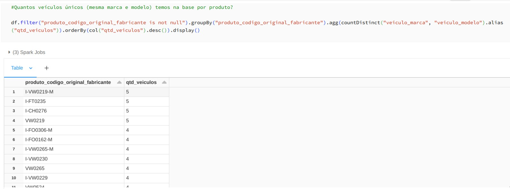
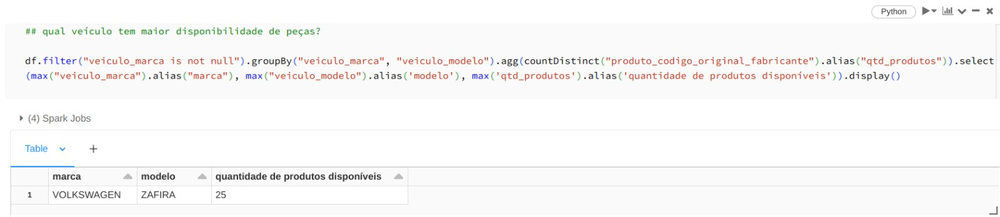

- [Arquitetura da solução](#arquitetura-da-solução)
  - [Arquitetura medalhão](#arquitetura-medalhão)
  - [formato de arquivo](#formato-de-arquivo)
- [Databricks](#databricks)
- [Ingestão dos dados (camada leading -\> bronze)](#ingestão-dos-dados-camada-leading---bronze)
- [Validação dos dados (camada bronze -\> silver)](#validação-dos-dados-camada-bronze---silver)
- [Enrriquecimento dos dados (camada silver -\> gold)](#enrriquecimento-dos-dados-camada-silver---gold)
- [Serving dos dados (camada gold -\> datawarehouse)](#serving-dos-dados-camada-gold---datawarehouse)
- [Análises](#análises)
- [Resultados](#resultados)
  - [Quantos produtos unicos temos na base?](#quantos-produtos-unicos-temos-na-base)
  - [Quantos produtos únicos temos na base por categoria ?](#quantos-produtos-únicos-temos-na-base-por-categoria-)
  - [Quantos veículos únicos (mesma marca e modelo) temos na base por produto?](#quantos-veículos-únicos-mesma-marca-e-modelo-temos-na-base-por-produto)
  - [Qual veículo tem maior disponibilidade de peças?](#qual-veículo-tem-maior-disponibilidade-de-peças)
  - [Qual ano possui mais peças disponíveis?](#qual-ano-possui-mais-peças-disponíveis)


# Arquitetura da solução

Para compor a solução foram utilizados duas clouds, Google Cloud para criar o datalake como o google cloud storage, e o BigQuery como datawarehouse, foi utilizado também a cloud Microsoft Azure para provisionar o [databricks](https://www.databricks.com/)

## Arquitetura medalhão

A arquitetura medallion descreve uma série de camadas de dados que denotam a qualidade dos dados armazenados no datalake.
Essa arquitetura garante a atomicidade, consistência, isolamento e durabilidade à medida que os dados passam por várias camadas de validações e transformações antes de serem armazenados em um layout otimizado para análise eficiente. Os termos leading zone (camada de pouso), bronze (bruto), prata (validado) e ouro (enriquecido) descrevem a qualidade dos dados em cada uma dessas camadas.


## formato de arquivo
Em uma datalake o formato de arquivo normalmente a ser utilizado é o formato parquet, 
O formato Parquet é um formato de armazenamento colunar otimizado para processamento de dados em larga escala. Ele foi desenvolvido para ser eficiente em termos de espaço e tempo, especialmente para ambientes de Big Data.
existe ainda o formato delta, que utilizada como base o formato parquet mas adicionando ao parquet o controle de transações, o delta fornece recursos de controle de transações, permitindo operações ACID (Atomicidade, Consistência, Isolamento e Durabilidade) em seus dados. Isso significa que você pode executar operações de inserção, atualização e exclusão com garantia de consistência e integridade dos dados. Delta também permite versionar seus dados, o que significa a possibilidade de realizar timetravel.


# Databricks

O Databricks é uma plataforma de análise e processamento de big data baseada em nuvem. Ela fornece um ambiente unificado para cientistas de dados, engenheiros de dados e analistas realizarem tarefas relacionadas a big data, como ingestão, processamento, análise e visualização de dados.

nesta solução foi utilizado o databricks para o ETL dos dados, utilizando o [Pyspark](https://awari.com.br/pyspark/?utm_source=blog) como framework para a manipulação dos dados.


# Ingestão dos dados (camada leading -> bronze)

Os arquivos são inicialmente armazenados na camada de aterrissagem conhecida como "zona líder" (leading zone). Essa camada é responsável por receber arquivos de diversas fontes diferentes e centralizar o recebimento de informações de vários locais. É comumente utilizada para receber arquivos nos formatos JSON, XLSX, CSV, entre outros.


Os dados são lidos pelo Databricks e transformados em um DataFrame, que é então salvo na camada bronze do data lake. Na camada bronze, os dados são mantidos "como estão" (as is), ou seja, sem transformações significativas nos dados. No entanto, uma coluna de controle é adicionada para registrar o momento da ingestão desses dados, além da remoção de caracteres especiais nos nomes das colunas.

Além disso, nessa etapa do processo, ocorre a ingestão dos dados provenientes da API de veículos compatíveis. É importante observar que os dados de veículos compatíveis não passam pela camada de pouso (leading zone) e são ingeridos diretamente na camada bronze. Isso ocorre porque esses dados não estão no formato de arquivo, e salvá-los na camada de pouso (leading zone) e, posteriormente, copiá-los para a camada bronze no mesmo formato seria redundante.

# Validação dos dados (camada bronze -> silver)

Nesta etapa do processo, ao contrário do que ocorre na camada bronze, os dados passam por transformações em sua estrutura. Aqui, há conversão de tipos de dados e também substituição de números com "," por ".".

Além disso, na tabela de veículos compatíveis,, os atributos são transformados em colunas, conforme solicitado no teste. Também é nesta etapa do processo que os dados provenientes da API de veículos compatíveis sofrem um "explode", como demonstrado nos códigos das duas situações abaixo.

```
# sobrescreve a coluna 'complemento' da tabela de veículos compatíveis, com o resultado do split dos dados da própria coluna + explode, tranformando cada item divido por '|' em uma nova linha.

dfApiCompatibleVehiclesBronze = dfApiCompatibleVehiclesBronze.withColumn("complemento", explode(split(dfApiCompatibleVehiclesBronze.complemento, "\|")))
```


```
# faz o pivot dos campos nome-atributo e valor-atributo.

dfProdutosTable = dfProdutosTable.groupBy('nome-sku', 'fabricante','codigo', 'composicao', 'categoria').pivot("nome-atributo").agg(first("valor-atributo"))
```


# Enrriquecimento dos dados (camada silver -> gold)

Nesta etapa, os dados são refinados de acordo com as regras de negócio específicas. Isso pode incluir tratamento de valores nulos, deduplicação, normalização de dados, padronização de formatos, agregação e cálculos complexos.

Além disso, nesta etapa, é realizado o join entre as tabelas "alias" e "produtos" para obtermos o campo "codigo-original-produto". Esse campo será utilizado no join da etapa subsequente como chave de cruzamento para identificar quais produtos são compatíveis com quais veículos. Para isso, é feito o join entre a tabela de produtos resultante e a tabela de veículos compatíveis, o código abaixo exemplificado as ações citadas acima.

```
# para obtermos o código original dos produtos disponivel na tabela de alias, é feito join utilizando a produto-codigo e o alias

dfProdutosTableSilver = (dfProdutosTableSilver
                .join(dfAliasSilver, dfProdutosTableSilver['produto-codigo'] ==  dfAliasSilver['alias'], how='left')
                .select(dfProdutosTableSilver["*"],dfAliasSilver["codigo-fabricante"].alias("produto-codigo-original-fabricante")))
```

```
## agora com o codigo original já disponivel, é feito mais um join entre a tabela resultante do comando 5 e a tabela de veiculos compativeis, utilizamos 
## como chave de cruzamento o codigo original do produto e o veiculo-codigo-produto-compativel

dfProdutosTableSilver  = (dfProdutosTableSilver
                .join(dfCompatibleVehiclesTableSilver, dfProdutosTableSilver["produto-codigo-original-fabricante"]==dfCompatibleVehiclesTableSilver["veiculo-codigo-produto-compativel"],how='left')
            )
```

# Serving dos dados (camada gold -> datawarehouse)

Aqui é realizado o carregamento dos dados da tabela da camada Gold para o data warehouse (BigQuery). Esse carregamento é feito por meio da ferramenta de carga de dados disponível no BigQuery, seguindo um processo normal de carga. É recomendável automatizar esse processo para manter os dados entre a camada Gold e o data warehouse sempre sincronizados.

A ferramenta de carga disponível no BigQuery facilita o processo de carregamento dos dados em uma tabela relacional, utilizando como fonte os arquivos Parquet localizados na camada Gold. É criada a tabela no data warehouse para armazenar os dados.


# Análises

As análises solicitadas no teste estão no arquivo bigQueryAnalises.py. O primeiro passo para iniciar as análises é carregar os dados da tabela relacional do BigQuery para um DataFrame Spark. O mesmo processo poderia ser realizado com o pacote Pandas, mas a performance do Spark é ligeiramente superior.

```
df = spark.read.format("bigquery").option("credentialsFile", "/dbfs/FileStore/gcloud/key/karhub_261f144c9490.json") \
      .option("parentProject", "karhub") \
      .option("project", "karhub") \
      .option("table",'kh_data_engineer_teste_roger_amaro') \
      .load()
```


# Resultados

## Quantos produtos unicos temos na base?


## Quantos produtos únicos temos na base por categoria ?


## Quantos veículos únicos (mesma marca e modelo) temos na base por produto?





## Qual veículo tem maior disponibilidade de peças?





## Qual ano possui mais peças disponíveis?


